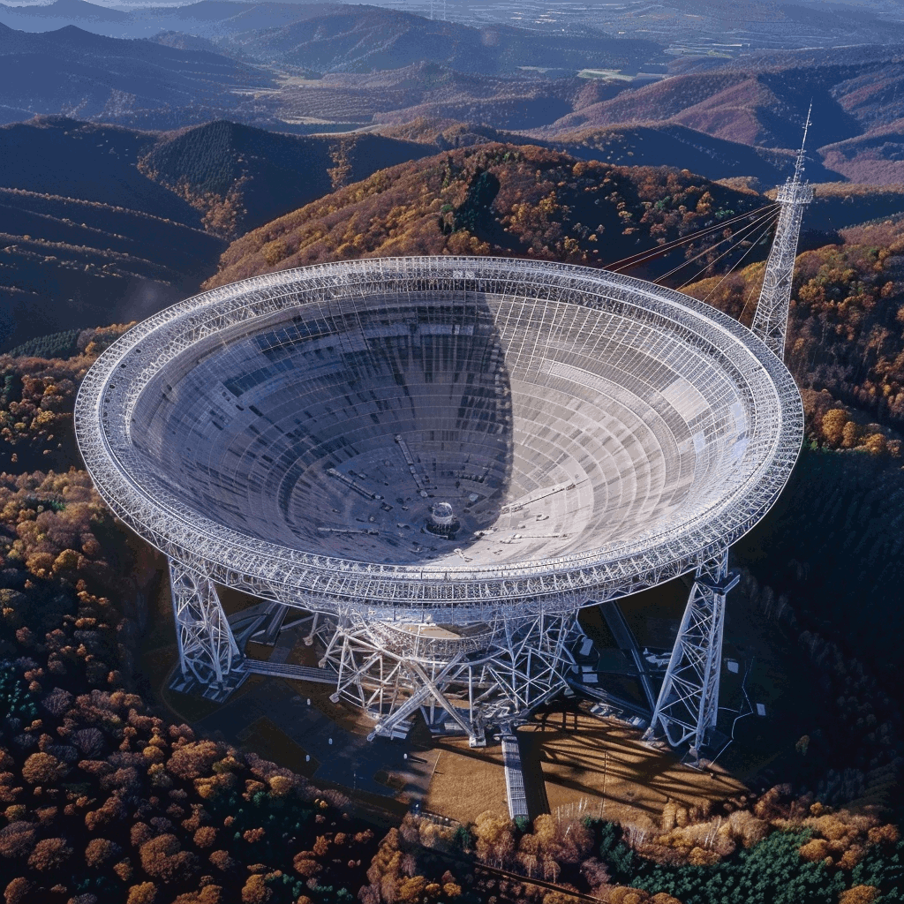

# RTL_433  24/7 scanning scripts
This is a collection of scripts to automate the scanning with RTL_433

see: [merbanan/rtl_433](https://github.com/merbanan/rtl_433)

### Usage
start_autoscan.py seconds start_freq end_freq step_freq
```bash
python3 start_autocapture.py --sec 30 --start 345000000 --stop 440000000 --step 1000000
```
